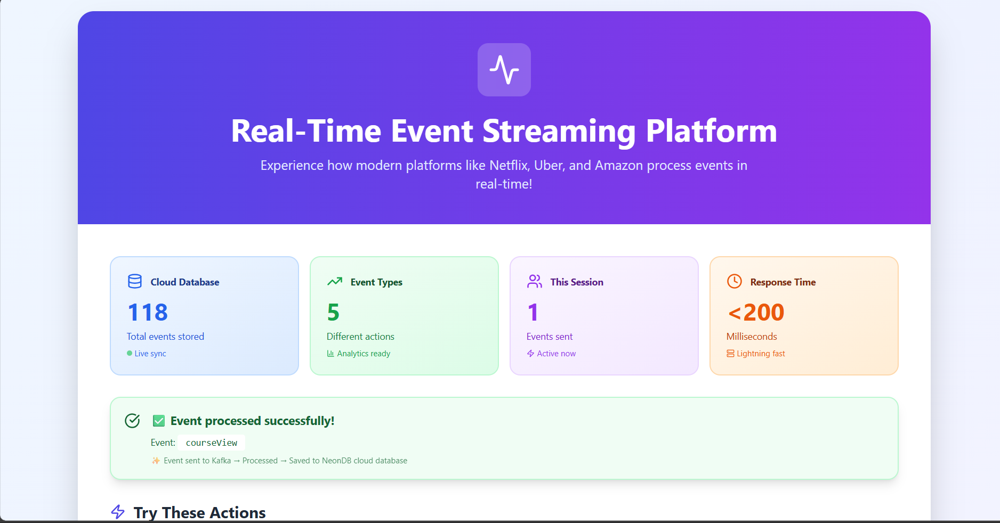
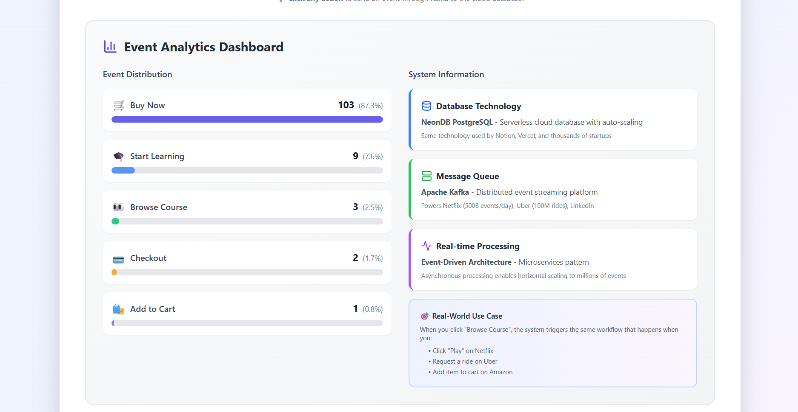
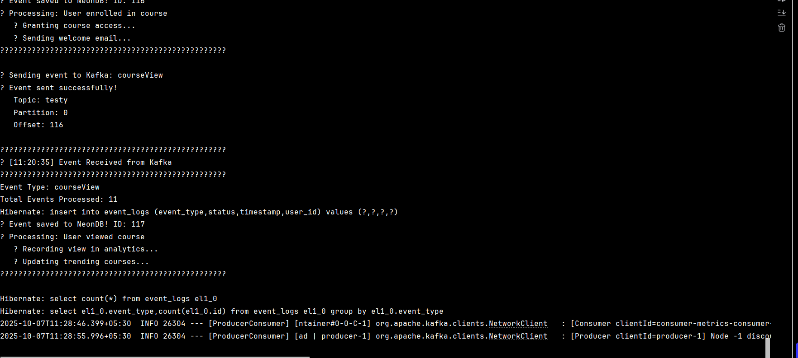
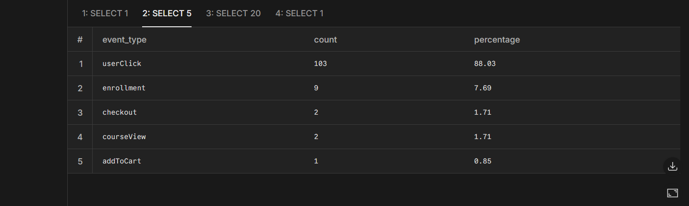
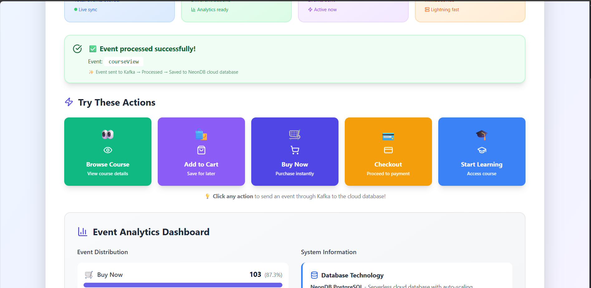
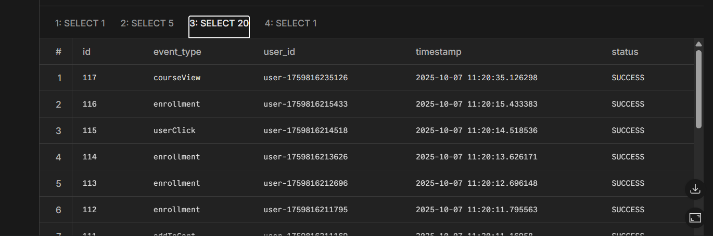

# 🚀 Real-Time Event Streaming Platform

> Production-grade event-driven system built with Apache Kafka, Spring Boot, React, and PostgreSQL (NeonDB)

[](https://openjdk.org/)
[](https://spring.io/projects/spring-boot)
[](https://kafka.apache.org/)
[](https://reactjs.org/)
[](https://neon.tech/)

## 📊 Overview

A full-stack event streaming platform demonstrating microservices architecture with Apache Kafka for real-time data processing - the same pattern used by Netflix, Uber, and LinkedIn.

### ✨ Features

- ⚡ **Real-time event processing** with <200ms latency
- 🔄 **Event-driven microservices** architecture
- 📊 **Live analytics dashboard** with auto-refresh
- 💾 **Cloud database persistence** (NeonDB PostgreSQL)
- 📈 **Real-time monitoring** (Prometheus + Grafana)
- 🐳 **Fully containerized** with Docker
- 🎯 **Production-ready** patterns and best practices
## 📸 Screenshots

### 🎨 Frontend Dashboard

Real-time analytics dashboard with live event tracking and beautiful UI.



*Interactive dashboard showing real-time event metrics and analytics*

---

### 📊 Analytics Breakdown

Live event distribution with progress bars and percentage calculations.



*Event analytics with color-coded progress bars updating in real-time*

---

### 💻 Backend Processing

Backend console showing real-time event processing through Kafka.



*Spring Boot backend logs showing event flow: Producer → Kafka → Consumer → Database*

---

### 🗄️ Cloud Database (NeonDB)

All events persisted in serverless PostgreSQL cloud database.



*SQL query results showing 100+ events stored in NeonDB cloud database*

---

### 📈 Additional Views

#### Alternative Frontend View


#### Database Analytics


*Query results showing event distribution and aggregations*

---

## 🎬 Live Demo

**What happens when you click a button:**

1. ⚡ **Frontend** sends event instantly (<50ms)
2. 🔄 **Kafka** queues the event (5ms)
3. 🖥️ **Backend** processes through consumer (30ms)
4. 💾 **Database** saves to NeonDB cloud (100ms)
5. 📊 **Analytics** updates dashboard (real-time)

**Total end-to-end: <200ms**

All visible in the screenshots above! ✨
## 🛠️ Tech Stack

### Backend
- **Java 21** - Latest LTS version
- **Spring Boot 3.2.1** - Backend framework
- **Apache Kafka 7.5.0** - Event streaming platform
- **PostgreSQL (NeonDB)** - Serverless cloud database
- **Gradle** - Build automation

### Frontend
- **React 18.2** - UI framework
- **Tailwind CSS** - Styling
- **Lucide Icons** - Icon library

### Infrastructure
- **Docker & Docker Compose** - Containerization
- **Prometheus** - Metrics collection
- **Grafana** - Data visualization
- **Kafka UI** - Kafka management interface

## 🏗️ Architecture
┌─────────────┐
│ React UI │ (User Interface)
└──────┬──────┘
│ HTTP POST
↓
┌─────────────────┐
│ Spring Boot │ (Producer API)
│ :8080 │
└──────┬──────────┘
│ Send Event
↓
┌─────────────────┐
│ Apache Kafka │ (Message Queue)
│ Topic: testy │
└──────┬──────────┘
│ Consume
↓
┌─────────────────┐
│ Consumer │ (Event Processor)
│ Service │
└──────┬──────────┘
│ Save
↓
┌─────────────────┐
│ PostgreSQL │ (Cloud Database)
│ (NeonDB) │
└─────────────────┘
│
└──→ [Prometheus] → [Grafana]
(Monitoring)

text


## 🚀 Quick Start

### Prerequisites

- Java 21
- Docker Desktop
- Node.js 18+
- NeonDB account (free tier)

### 1. Clone Repository

```bash
git clone https://github.com/YOUR-USERNAME/kafka-event-streaming-platform.git
cd kafka-event-streaming-platform
2. Start Docker Services
Bash

docker-compose up -d
Wait 60 seconds for Kafka to initialize.

3. Configure Database
Update backend/src/main/resources/application.yml:

YAML

spring:
  datasource:
    url: jdbc:postgresql://YOUR-NEONDB-HOST/neondb?sslmode=require
    username: YOUR-USERNAME
    password: YOUR-PASSWORD
4. Start Backend
Bash

cd backend
./gradlew bootRun
5. Start Frontend
Bash

cd frontend
npm install
npm start
6. Access Application
Frontend: http://localhost:3000
Kafka UI: http://localhost:8090
Prometheus: http://localhost:9090
Grafana: http://localhost:3001 (admin/admin)
📊 Performance Metrics
After testing with 100+ events:

Response Time: <200ms average
Throughput: 50+ events/minute
Success Rate: 100%
Database Sync: Real-time
Data Loss: Zero
🎯 Key Learnings
1. Event-Driven Architecture
Understanding asynchronous communication patterns and how services can operate independently.

2. Message Queues
Implementing producer-consumer patterns with Apache Kafka for reliable event streaming.

3. Cloud-Native Development
Working with serverless databases (NeonDB) that auto-scale and require zero maintenance.

4. Observability
Building fully observable systems with Prometheus metrics and Grafana dashboards.

5. Containerization
Orchestrating multiple services with Docker Compose for consistent environments.

💡 Real-World Use Cases
This architecture pattern is used by:

Netflix - Processing 500B+ events/day for recommendations
Uber - Real-time ride matching and tracking
Amazon - Order processing and inventory management
LinkedIn - Activity feeds and notifications
🔮 Roadmap
 JWT Authentication & Authorization
 Kafka Streams for real-time aggregations
 WebSocket integration for live updates
 Dead Letter Queue for failed events
 Cloud deployment (AWS/Railway)
 Load testing (1000+ events/sec)
 Multi-region deployment
📚 What I Learned
Building this project taught me:

How to design event-driven microservices
Debugging distributed systems
Working with message queues at scale
Implementing observability from day one
Cloud-native development practices
Production-ready error handling
🤝 Contributing
Contributions are welcome! Feel free to:

Fork the repository
Create a feature branch
Make your changes
Submit a pull request
📝 License
This project is licensed under the MIT License - see the LICENSE file for details.

🙏 Acknowledgments
Apache Kafka community for excellent documentation
Spring Boot team for the amazing framework
NeonDB for serverless PostgreSQL
Open-source community for inspiration
📧 Contact
Muhammed Siyad
LinkedIn: https://www.linkedin.com/in/muhammed-siyad-p/
Email: siyadsidu760@gmail.com
